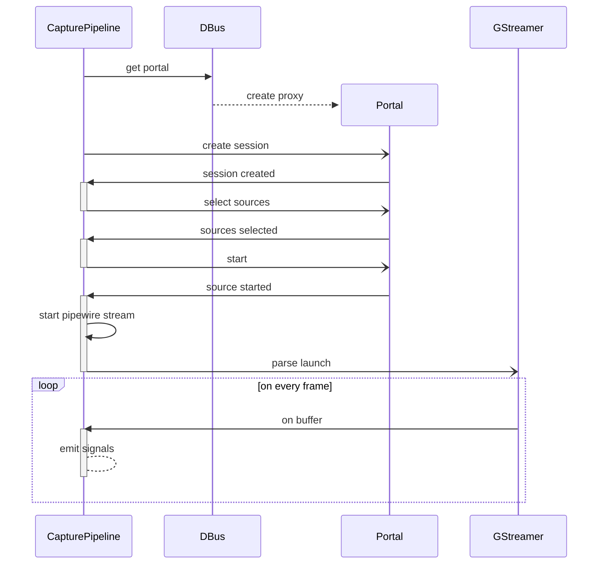
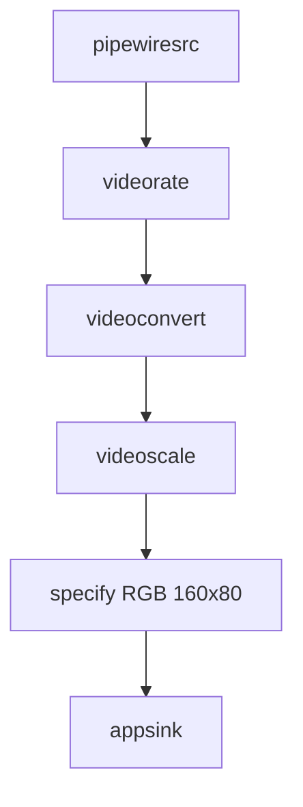

# Capture Pipeline

## Get video frames

The capture pipeline uses the XDG desktop portal to get
a filehandle for a stream of video frames.

When interacting with the portal asynchronous messages
are sent over D-Bus.

Once the filehandle has been obtained ("source started"),
the filehandle is used with a Gstreamer pipleline ("parse
launch") to get the video frames.

Every video frame is received by a callback ("on buffer")
where the dominant color is determined and the frame is
converted to an image.  Both dominant color and frame image
are made available to the application using Qt's signal and
slot mechanism.

# GStreamer Pipeline

The GST pipeline receives the stream of video frames.
It limits the framerate to something manageable, and
downscales the image to a smaller size for more efficient
processing.  Finally the frame is sent to the Python callback.

